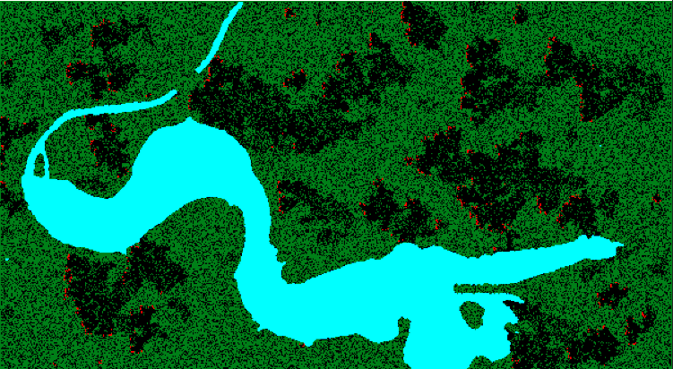
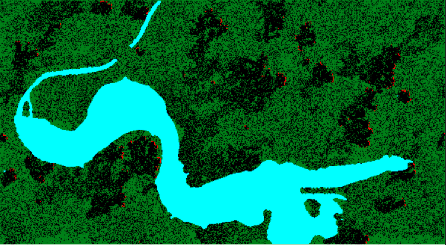

# Forest_Fire

Projekt automatu komórkowego "Pożar lasu".

4 stany komórek: 
- Drzewo żywe
- Drzewo palące się
- Drzewo spalone
- Woda

Automat dodatkowo uzględnia parametr jakim jest kierunek wiatru.

Przykładowe wyniki:

Dla wiatru północnego:

Dla wiatru wschodniego:

Dla wiatru południowo-zachodniego:

Bez wiatru:

